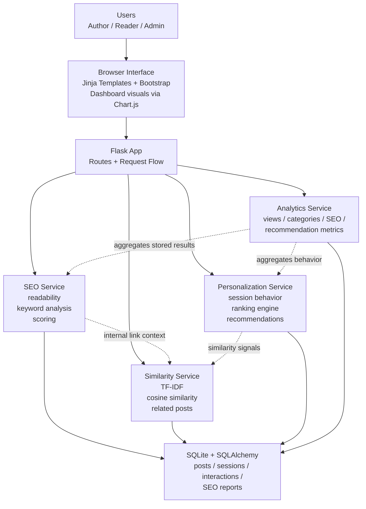

# WaveBlog AI

WaveBlog AI is a self-contained AI-powered blogging platform built for demo-ready author and reader workflows. It combines blog creation and editing, rule-based SEO analysis, internal link suggestions, session-based personalization, interaction tracking, and an analytics dashboard using only local content and in-platform behavior.

## Features

- Author flow with create and edit screens for posts, metadata, categories, and tags
- SEO analysis with score, readability, keyword candidates, checks, warnings, and suggestions
- Internal link suggestions powered by explainable content similarity
- Reader flow with related posts and session-based personalized recommendations
- Interaction logging for views, recommendation clicks, and dwell time
- Analytics dashboard with content, engagement, category, and SEO summary metrics
- Seeded demo content and seeded interaction history for believable local demos

## Stack

- Flask
- SQLite
- SQLAlchemy
- Jinja templates
- Bootstrap 5
- Chart.js
- `textstat`

## Architecture

The application is structured as a single Flask app with route blueprints, service-layer business logic, and a shared SQLite database accessed through SQLAlchemy models.



### Request flow at a glance

- Author actions go through `app/routes/posts.py`, which persists posts and calls the SEO and similarity services for analysis and internal link suggestions.
- Reader actions go through `app/routes/main.py` and `app/routes/posts.py`, which create anonymous sessions, log interactions, and request personalized recommendations.
- Dashboard requests go through `app/routes/analytics.py`, which pulls aggregated metrics from the analytics service.
- Shared persistence lives in `app/models.py`, with seed/demo data loaded from `app/seed.py`.

## Local setup

1. Create and activate a virtual environment.
2. Install dependencies:

```bash
pip install -r requirements.txt
```

3. Run the app:

```bash
python run.py
```

The app creates the SQLite database in `instance/blog.db` on first boot and loads the demo seed automatically when the database is empty.

## Seed instructions

The application auto-seeds on first run. To reload the demo corpus from scratch:

```bash
flask --app run seed --reset
```

To seed only when the database is empty:

```bash
flask --app run seed
```

## Run instructions

- Start locally with `python run.py`
- Open `http://127.0.0.1:5000`
- Use the top navigation to move between Home, Author Studio, and Dashboard

## Suggested demo flow

1. Open the home page and point out seeded posts plus personalized recommendations.
2. Open a post detail page to show reader-facing content, related posts, and tracked recommendations.
3. Visit a few posts to generate fresh reader history.
4. Create or edit a post in Author Studio.
5. Use `Save + Analyze SEO` to show SEO scoring, warnings, suggestions, and internal link suggestions.
6. Return to the post detail page and rerun analysis if needed.
7. Open the dashboard to show top posts, category momentum, dwell time, recommendation clicks, and SEO summaries.

## Validation

Run the repo tests from the project root:

```bash
pytest -q
```
